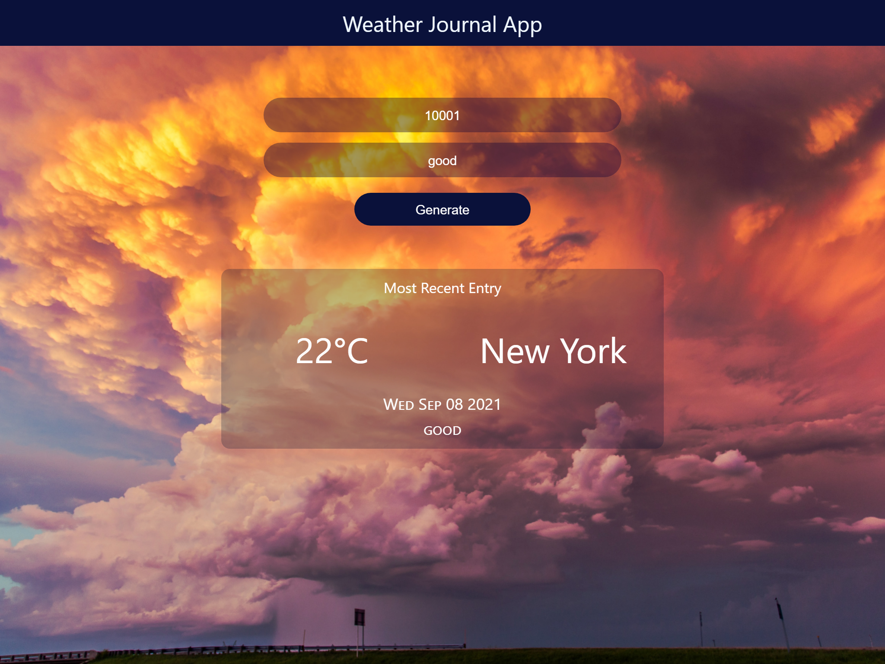

# FWD ND : Weather-Journal App Project

## Overview

This project requires you to create an asynchronous web app that uses Web API and user data to dynamically update the UI.

### CRITERIA

- #### Project Environment Setup

  - Node and Express Environment
  - Project Dependencies
  - Local Server
  - HTML API Credentials

- #### APIs and Routes

  - APP API Endpoint
  - Integrating OpenWeatherMap API
  - Return Endpoint Data || GET Route I: Server Side
  - Return Endpoint Data || GET Route II: Client Side
  - POST Route

- #### Dynamic UI

  - Naming HTML Inputs and Buttons For Interaction
  - Assigning Element Properties Dynamically
  - Event Listeners
  - Dynamically Update UI

- #### Documentation

  - README
  - Comments
  - Code Quality

- #### addition

  - Add an error lable to show the error for user.
  - Add city name

### our steps to did it

1. First : start with standerd project file from udacity
2. Update its HTML structure
3. Update its CSS style
4. build build our server in server.js
5. build functionality and APIs with JavaScript at client side in app.js
6. test website, all functions, APIs, and events
7. write README

### used to build it

- HTML 5
- CSS 3
- JS
- Node js

---

- #### img and some styles
  - Backgroung photo
    Photo by <a href="https://unsplash.com/@noaa?utm_source=unsplash&utm_medium=referral&utm_content=creditCopyText">NOAA</a> on <a href="https://unsplash.com/photos/ZVhm6rEKEX8?utm_source=unsplash&utm_medium=referral&utm_content=creditCopyText">Unsplash</a>

### Live photo

